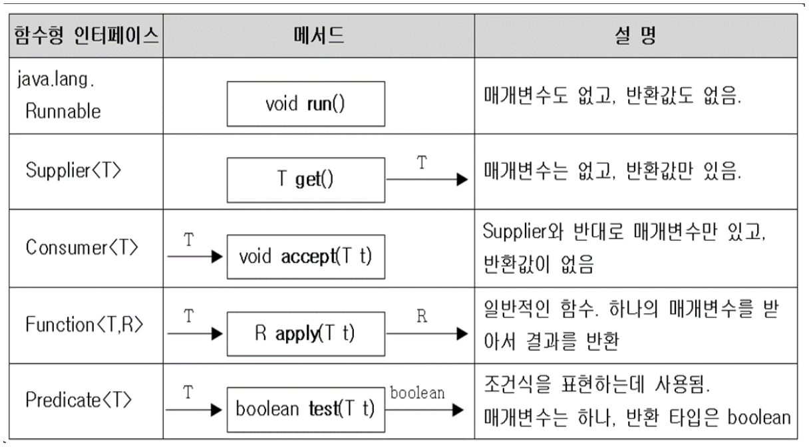
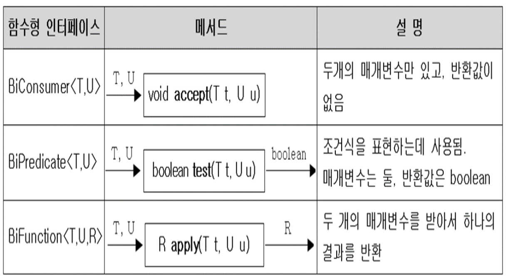
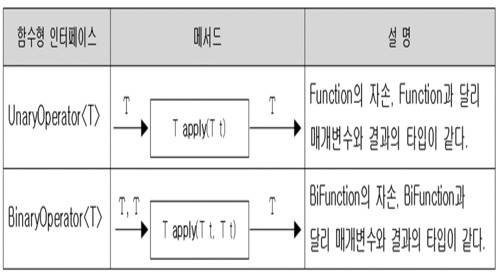
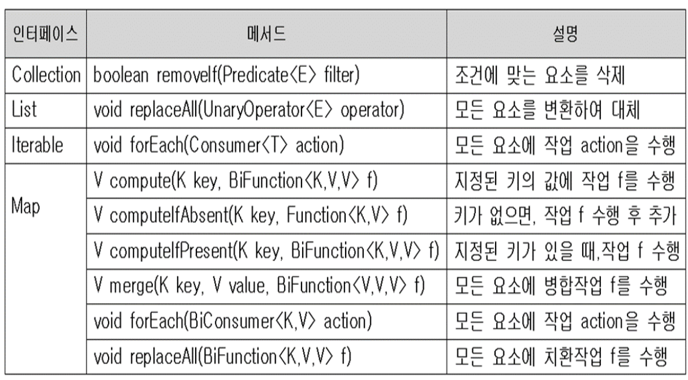
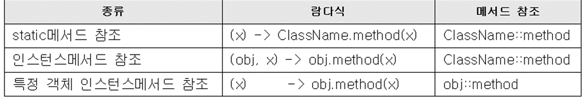

# Lambda

​	OOP언어인 java에서 함수형 언어를 지원하기 위해 JDK 1.8부터 지원

​	현재 빅데이터를 다루는데 haskell, scala 등 함수형 언어들이 각광받고 있다.


### Lambda Expression

- 함수(메소드)를 간단한 식(expression)으로 표현하는 방법

  ``` java
  int max(int a, int b) {
      return a > b ? a : b;
  }
  
  (a,b) -> a > b ? a : b
  ```

  이렇듯 익명 함수 (anonymous function) 으로 만들어 주는거다.

  위에서 보듯, 메소드의 반환타입, 이름을 지우고 파라미터 괄호() 뒤에 ->를 붙여준다. 그리고 대괄호를 지워주고 return문을 생략할 수 있다.(끝에 ; 안붙인다)

- 함수와 메소드의 차이

  1. 근본적으론 동일하다. 함수는 일반적인 용어이고 메소드는 객체지향개념 용어이다.

  2. 함수는 클래스에 독립적이고, 메소드는 클래스에 종속적이다. (자바에서 메소드는 항상 클래스 내부에 존재해야 함.)

     2-1. 물론 자바엔 메소드밖에 존재하지 않는다.

- 람다식의 예

  ``` java
  // 1 
  int max(int a, int b) {
      return a > b ? a : b;
  }
  // 2
  int printVar(String name, int i) {
      System.out.println(name + "=" + i);
  }
  // 3
  int square(int x) {
      return x * x;
  }
  //4
  int roll() {
      return (int)(Math.random() * 6);
  }
  
  // 1
  (a, b) -> a > b ? a : b
      
  // 2
  (name, i) -> System.out.println(name + "=" + i)
      
  // 3
  x -> x * x
  
  // 4
  () -> (int)(Math.random()*6)
  ```

  

### 람다식 작성시 주의사항

1. 매개변수가 하나인 경우, 괄호() 생략가능(타입이 없을 때만)

   ``` java
   (a) -> a*a  ==> a -> a*a // 가능
   (int a) -> a*a ==> int a -> a * a // 불가능
   ```

2. 블록 안의 문장이 하나뿐 일 때, 괄호{}생략가능(끝에 ; 안붙임)

   ``` java
   (int i) -> {					
       System.out.println(i); ==> (int i) -> System.out.println(i)
   }
   ```

   단, 하나뿐인 문장이 return문이면 괄호{} 생략불가

   ``` java
   (int a, int b) -> { return a > b ? a : b;} // 가능
   (int a, int b) -> return a > b ? a : b // 불가능
   ```


### 자바에서 람다식은 익명 함수가 아니라 익명 객체이다.

``` java
(a, b) -> a > b ? a : b ==> new Object() {
    							int max(int a, int b) {
                                    return a > b ? a : b;
                                }
							}
```

- 람다식을 다루기 위한 참조변수가 필요하다. 참조변수의 타입은 object이다.

  ``` java
  Object obj = new Object() {
      int max(int a, int b) {
          return a > b ? a : b;
      }
  };
  ```

  그런데 이렇게 해도 obj 참조변수로 max 메소드에 접근하지 못한다. Object 클래스엔 max 메소드가 정의되어 있지 않기 때문이다.


### 함수형 인터페이스

- 함수형 인터페이스 - 단 하나의 추상 메소드만 선언된 인터페이스

  ``` java
  @FunctionalInterface
  interface MyFunction {
      int max(int a, int b);
  }
  
  main() {
      MyFunction f = new MyFunction() {
          @Override
          public int max(int a, int b) {
              return a > b ? a : b;
          }
      };
      f.max(3,5);
      MyFunction f = (a, b) -> a > b ? a : b;
  }
  
  ```

  이렇게 람다식(익명 객체)을 다루기 위한 참조변수의 타입은 함수형 인터페이스로 한다.


- 함수형 인터페이스 타입의 매개변수

  ``` java
  public class Test {
      public static void main(String[] args) {
          method(() -> System.out.println("ㅇㅇ"));
          method(method());
      }
  
      static void method(MyFunction f) {
          f.method();
      }
  
      static MyFunction method() {
          return () -> System.out.println("MyMethod");
      }
  }
  
  @FunctionalInterface
  interface MyFunction {
     
      void method();
  }
  ```


### java.util.function 패키지

- 자주 사용되는 다양한 함수형 인터페이스를 제공한다. 이걸 이용해 표준화를 해줄 수 있다.

  

  ``` java
  Predicate<String> isEmptyStr = s -> s.length() == 0; // 제레릭때문에 유추 가능해서 String s 안해도 됨
  String s = "";
  if(isEmptyStr.test(s)) // if(s.length() == 0)
      System.out.println("This is an empty String");
  ```

- 매개변수가 2개인 함수형 인터페이스

  

  앞에 Bi를 붙여서 매개변수를 두개 받는 인터페이스를 만들어 놓은 것 이다.

  Supplier는 매개변수가 없는 인터페이스이기 때문에 여기에 해당하지 않는다.


- 매개변수의 타입과 반환타입이 일치하는 함수형 인터페이스(Function 인터페이스 상속)

  

  ``` java
  @FunctionalInterface
  public interface UnaryOperator<T> extended Function<T,T> { // Function 인터페이스를 상속함
      static <E> UnaryOperator<E> identity() {
          return t -> t; // 항등함수.
      }
  }
  ```


### Predicate의 결합

- and(), or(), negate()로 두 Predicate를 하나로 결합(default 메소드)

  ``` java
  Predicate<Integer> p = i -> i < 100;
  Predicate<Integer> q = i -> i < 200;
  Predicate<Integer> r = i -> i%2 == 0;
  
  Predicate<Integer> notP = p.negate(); // !(i < 100)
  Predicate<Integer> all = notP.and(q).or(r); // 100 <= i && i < 200 || i%2 ==0
  Preducate<Integer> all2 = notP.and(q.or(r)); // 100 <= i && (i < 200 || i%2 ==0)
  ```

- 등가비교를 위한 Predicate의 작성에는 isEqual()을 사용(static 메소드)

  ``` java
  Predicate<String> p = Predicate.isEqual(str);
  Boolean result = p.test(str2);
  // 위 아래의 식은 같은 식이다.
  boolean result = Predicate.isEqual(str).test(str2);
  
  ```

  ``` java
  Predicate<String> p = Predicate.<String>isEqual(str); // 지네릭 메소드에 타입 변수 생략 가능
  
  Predicate<String> p = new Predicate<>() {
      @Override
      public boolean test(String x) {
          return x.equals(str);
      }
  };
  Predicate<String> p = x -> x.equals(str);
  // 다 같은 말이다.
  
  ```

### Function의 결합

- andThen(), compose()

  ``` java
  Function<String, Integer> f = s -> Integer.parseInt(s);
  Function<Integer, String> g = i -> Integer.toBinaryString(i);
  
  Function<String, String> h = f.andThen(g); // = f(g(x))
  Function<Integer, Integer> h2 = f.compose(g); // g(f(x))
  
  // 합성함수를 만드는 건데 자료형만 잘 맞춰주면 된다.
  ```

  

### CF와 함수형 인터페이스

- 함수형 인터페이스를 사용하는 컬렉션 프레임웍의 메소드(와일드 카드 생략)

  


### 메소드 참조(Method Reference)

- 하나의 메소드만 호출하는 람다식은 '메소드 참조'로 간단히 할 수 있다.




- 생성자와 메소드 참조

  ``` java
  Suplier<MyClass> s = () -> new MyClass();
  Suplier<MyClass> s = MyClass::new;
  
  Function<Integer, MyClass> f = i -> new MyClass(i);
  Function<Integer, MyClass> f = myClass::new;
  
  BiFunction<String, Integer, MyClass> f = MyClass::new;
  ```

- 배열과 메소드 참조

  ``` java
  Function<Integer, int[]> f = x -> new Int[x];
  Function<Integer, int[]> f = int[]:new;
  ```

  


## E = MC^2 ==> Error = (More Code) ^ 2 란다. 요즘 추세는 갈수록 코드가 짧아지는 추세 파이썬의 철학도 이거였지??

