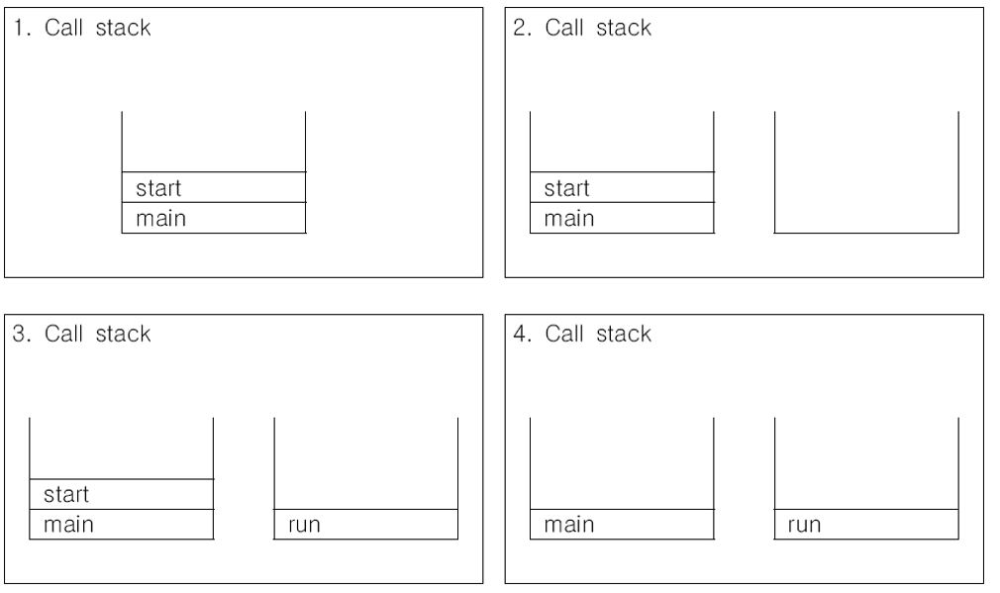
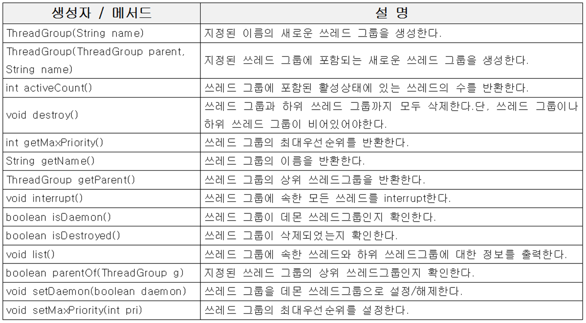
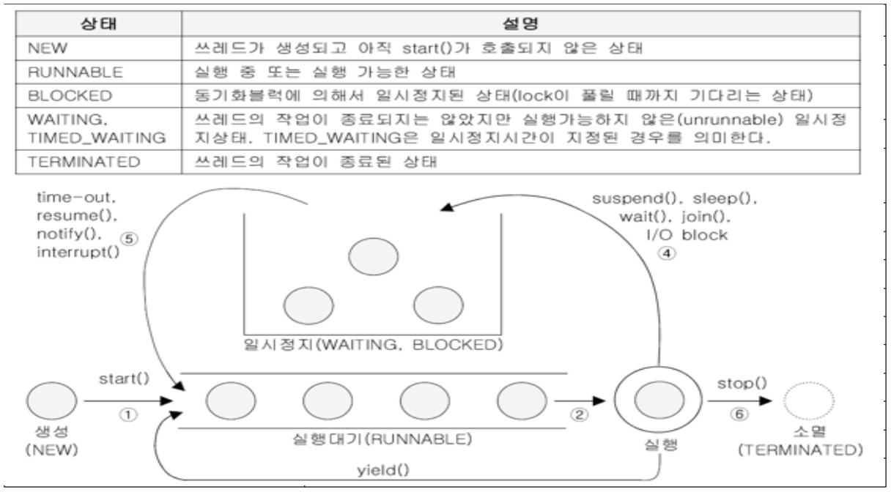

# 프로세스와 쓰레드


- 프로그램이란 실행 가능한 파일을 말하고, 프로세스는 실행중인 프로그램을 말한다. 즉 어떠한 파일이 실행중이라는 것은 프로세스가 운영체제의 메모리에 상주하고 있다는것을 뜻한다

- 프로세스는 실행중인 프로그램으로, 자원(resource)과 쓰레드로 구성 되어있다.

- 쓰레드는 프로세스 내에서 실제 작업을 수행하는 역할을 한다. 따라서 모든 프로스세는 하나 이상의 쓰레드를 가진다.

  > 프로세스 : 쓰레드 = 공장 : 일꾼 // 이렇게 비교할 수 있다.

- 싱글 쓰레드 프로세스 : 자원 + 쓰레드 , 멀티 쓰레드 프로세스 : 자원 + 쓰레드 + 쓰레드 + ...

- 

### 멀티프로세스 vs 멀티쓰레드

```
하나의 새로운 프로세스를 생성하는 것보다
하나의 새로운 쓰레드를 생성하는 것이 더 적은 비용이 든다.
```


### 멀티쓰레드의 장단점

```
많은 프로그램들이 멀티쓰레드로 작성되어 있다.
그러나, 멀티쓰레드 프로그래밍이 장점만 있는 것은 아니다.
```


| 장점 | - 자원을 보다 효율적으로 사용할 수 있다.<br />- 사용자에 대한 응답성(Responseness)이 향상된다.<br />- 작업이 분리되어 코드가 간결해 진다.<br />- 기타 등등 |
| :--: | :----------------------------------------------------------: |
| 단점 | - 동기화(Synchronization)에 주의해야 한다.<br />- 교착상태(dead-lock)가 발생하지 않도록 주의해야 한다.<br />- 각 쓰레드가 효율적으로 고르게 실행될 수 있게 해야 한다<br /> - 프로그래밍할 때 고려해야 할 사항들이 많다. |


##### 교착상태(Dead-Lock) : 다수의 쓰레드가 lock을 획득하기 위해 기다리는데, 이 lock을 잡고 있는 쓰레드도 똑같이 다른 lock을 기다리며 서로 블록 상태에 놓이는 것을 말한다. 데드락은 다수의 쓰레드가 같은 lock을 동시에, 다른 명령에 의해, 획득하려 할 때 발생할 수 있다.

예를 들자면, thread1 이 A의 lock을 가지고 있는 상태에서 B 의 lock을 획득하려 한다. 마찬가지로, thread2 는 B의 lock을 가진 상태에서 A의 lock을 획득하려 한다. 이러면 데드락이 생긴다. A 와 B는 서로 절대 원하는 lock을 얻을 수 없고, 두 쓰레드 중 어느쪽도 이 사실을 모른다

``` 
Thread 1 locks A, waits for B
Thread 2 locks B, waits for A
```

코드로 표현하면 이렇다

``` java
public class TreeNode {
    TreeNode parent = null;
    List children = new ArrayList();
    
    public synchronized void addChild(TreeNode child) {
        if(!this.children.contains(child)) {
            this.children.add(child);
            child.setParentOnly(this);
        }
    }
    
    public synchronized void addChildOnly(TreeNode child) {
        if(!this.children.contains(child)) {
            this.children.add(child);
        }
    }
    
    public synchronized void setParent(TreeNode parent) {
        this.parent = parent;
        parent.addChildOnly(this);
    }
    
    public synchronized void setParentOnly(TreeNode parent) {
        this.parent = parent;
    }
}
```


Thread 1이 parent.addChild(child) 메소드를, Thread 2 는 child.setParent(parent) 메소드를 각각 동시에, 같은 parent와 child 인스턴스에 호출한다면, 데드락이 발생할 수 있다.

> 나중에 데드락에 대해 다시 공부해야함


### 쓰레드의 구현과 실행

``` java
class MyThread extends Thread { //Thread 클래스를 상속
    @Override
    public void run() { /* 작업내용 */} //Thread 클래스의 run()을 오버라이딩.
}

class MyThread implements Runnable {
    public void run() {/* 작업내용 */} // Runnable인터페이스의 추상메서드 run()을 구현
}

Thread thread = new Thread(new Runnable(){ //생성자의 파라미터로 Runnable interface
    @override
    public void run() {/* 작업내용 */} 
});
```


### start() & run()

``` java
class ThreadTest {
    public static void main(String[] args) {
        MyThread t1 = new MyThread();
        t1.start();
    }
}
class MyThread extends Thread {
    public void run() {}
}
```




main 메소드에서 쓰레드를 실행했을 때 의 과정이다.

콜 스택에서 메인 메소드를 통해 start() 메소드가 실행되면 start() 메소드는 새로운 콜 스택을 만든다.

그리고 그 콜스택에 run() 메소드가 담긴 후 start() 메소드는 종료된다.

이래서 main 메소드가 종료되더라도, run 메소드가 계속 유지되어 프로그램이 종료되지 않을 수 도 있다.


### 싱글쓰레드 vs 멀티쓰레드

``` java
class ThreadTest {
    public static void main(String[] args) {
        for(int i = 0; i<300; i++) {
            System.out.println("-")
        }
        
        for(int i = 0; i<300; i++) {
            System.out.println("|");
        }
    }
}

class ThreadTest2 {
    public static void main(String[] args) {
        MyThread1 th1 = new MyThread1();
        MyThread2 th2 = new MyThread2();
        th1.start();
        th2.start();
    }
}
class MyThread1 extends Thread {
    public void run() {
        for(int i=0; i<300; i++) {
            System.out.println("-");
        }
    }
}
class MyThread2 extends Thread {
    public void run() {
        for(int i=0; i<300; i++) {
            System.out.println("|");
        }
    } 
}
```

자, 이렇게 구현하고 돌렸다고 가정하자.

싱글쓰레드일 경우에 작업자가 한명이니까 다수의 일을 동시에 수행할 수 없다. 따라서 -가 300개 출력되고, |가 300개 출력될 것 이다. 이 순서는 절대로 바뀌지 않는다.

하지만 멀티 쓰레드일 경우엔 작업자가 다수이다. 지금 이 상황에선 작업자가 두명이고, 작업도 두개다.  그리고 그 작업은 번갈아가며 동시에 수행된다. 따라서 -와 | 가 엇갈리며 출력될 것이다. 300개씩은 출력하는데 어떠한 규칙으로 출력되는지는 알 수 없다. 작업은 <b>os의 스케쥴러</b>가 관리하기 때문이다.

이렇게 구현한다면 어떤게 좋은 프로그래밍이라고 할 수 있을까

시간적인 측면에서 본다면, 멀티쓰레드가 작업을 동시에 수행하니, 멀티쓰레드쪽이 더 효율적이라고 판단할 수 있지만, 답은 싱글쓰레드가 약간 더 빠르다. 작업을 하다 다른 작업으로 넘어갈 때 **Context Switching**을 하게되는데, 이 때 시간이 소요된다. 

하지만 효율 면에서 훨씬 좋다. 싱글 쓰레드라면, 채팅을 예로 들어 파일을 업로드해주는 동안 채팅을 입력할 수 없다.


### Thread I/O Blocking

​	Thread I/O Blocking이란, 어떤 쓰레드에서 입출력할 때 작업이 중단되는 것을 말한다.  우리가 자바에서 Scanner로 신나게 입력을 할 때에도 입력이 들어가기 전에 프로그램이 자동으로 실행되지 않듯이 입력을 받을 때 계속 기다리는 것을 말한다. 이럴 때 멀티 쓰레드로 구현한다면, A에서 I/O Blocking이 일어나더라도, B에선 다른 작업을 계속 할 수 있을 것이다.

### Thread Priority of Thread

​	작업의 중요도에 따라 쓰레드의 우선순위를 다르게 하여 특정 쓰레드가 더 많은 작업시간을 갖게 할 수 있다.

``` java
void setPriority(int newPriority) // 쓰레드의 우선순위를 지정한 값으로 변경.
int getPriority() // 쓰레드의 우선순위를 반환.
    
public static final int MAX_PRIORITY = 10; // 최대우선순위
public static final int MIN_PRIORITY = 1; // 최소우선순위
public static final int NORM_PRIORITY = 5; // 보통우선순위

//우선순위가 높은 쓰레드가 더 많은 작업 시간을 가질 수 있다.
```

​	JVM은 1~10까지의 우선순위를 가지고 있고, window는 32단계를 가지고 있다.

​	또한, JVM에서의 쓰레드 우선순위는 단지 희망사항일 뿐이다. 쓰레드는 결국 OS스케쥴러가 관리하가 때문이다.


### Thread Group

- 서로 관련된 쓰레드를 그룹으로 묶어서 다루기 위한 것
- 모든 쓰레드는 반드시 하나의 쓰레드 그룹에 포함되어 있어야 한다.
- 쓰레드 그룹을 지정하지 않고 생성한 쓰레드는 main쓰레드 그룹에 속한다.
- 자신을 생성한 쓰레드(부모 쓰레드)의 그룹과 우선순위를 상속받는다.

``` java
Thread(ThreadGroup group, String name);
Thread(ThreadGroup group, Runnable target);
Thread(ThreadGroup group, Runnable target, String name);
Thread(ThreadGroup group, Runnable target, String name, long stackSize);

ThreadGroup getThreadGroup(); // 쓰레드 자신이 속한 쓰레드 그룹을 반환한다.
void uncaughtException(Thread t, Throwable e); //처리되지 않은 예외에 의해 쓰레드 그룹의 쓰레드가 실행이 종료되었을 때, JVM에 의해 이 메소드가 자동으로 호출된다. JVM은 기본적으로 printStackTrace() 를 호출하는데, 이걸 오버라이딩 해 줄 수 있다.
```





### Daemon Thread

- 일반 쓰레드(non-daemon thread)의 작업을 돕는 보조적인 역할을 수행

- 일반 쓰레드가 모두 종료되면 자동적으로 종료된다.
- 가비지 컬렉터, 자동저장, 화면 자동갱신 등에 사용된다.
- 무한루프와 조건문을 이용해서 실행 후 대기하다가 특정조건이 만족되면 작업을 수행하고 다시 대기하도록 작성한다.

``` java
public void run() {
    while(true) {
        try {
            Thread.sleep(3 * 1000); //3초마다
        } catch(InterruptedException e) {}
        
        // autoSave 의 값이 true이면 autoSave()를 호출한다.
        if(autoSave) {
            autoSave();
        }
    }
}
```

``` java
boolean isDaemon(boolean on); //쓰레드가 데몬 쓰레드인지 확인한다. 데몬이면 true
void setDaemon(boolean on); //쓰레드를 데몬 쓰레드로 또는 사용자 쓰레드로 변경 매개변수 on을 true로 지정하면 데몬 쓰레드가 된다.
```

* setDaemon()은 반드시 start()를 호출하기 전에 실행되어야 한다. 그렇지 않으면 IllegalThreadStateException이 발생한다.


### 쓰레드의 상태




1. 쓰레드가 처음 생성되면 new 상태가 되고, start() 메소드가 실행되기 전 까지 대기한다.
2. start() 메소드가 실행되면 RUNNABLE 상태가 되고 저렇게 Queue 같이 생긴곳에 들어간다.
3. 자기 차례가 오면 실행을 하는데 4번 메소드에 있는 친구들을 만나면 일시정지상태가 된다.
4. 일시정지 상태에서 5번 친구들의 메소드를 만나면, 다시 yield() 메소드의 Queue에 들어간다.
5. 이 과정은 stop() 메소드를 만나기 전 까지 계속 실행되고, 다 마치면 소멸(TERMINATER)하게 된다.


### 쓰레드의 실행제어

- 쓰레드의 실행을 제어할 수 있는 메소드가 제공된다.

``` java
//지정된 시간(천분의 일초 단위)동안 쓰레드를 일시정지시킨다. 지정한 시간이 지나고 나면, 자동적으로 다시 실행대기상태가 된다.
static void sleep(long millis);
static void sleep(long millis, int nanos);

//지정된 시간동안 쓰레드가 실행되도록 한다. 지정된 시간이 지나거나 작업이 종료되면 join()을 호출한 쓰레드로 다시 돌아와 실행을 계속한다.
void join();
void join(long millis);
void join(long millis, int nanos);

//sleep()이나 join()에 의해 일시정지상태인 쓰레드를 깨워서 실행대기상태로 만든다. 해당 쓰레드에서는 Interrupted Exception이 발생함으로써 일시정지 상태를 벗어나게 된다.
void interrupt();

//쓰레드를 즉시 종료시킨다.
void stop();

//쓰레드를 일시정지시킨다. resume()을 호출하면 다시 실행대기상태가 된다.
void suspend();

//suspend()에 의해 일시정지상태에 있는 쓰레드를 실행대기상태로 만든다.
void resume();

//실행 중에 자신에게 주어진 실행시간을 다른 쓰레드에게 양보하고 자신은 실행대기상태가 된다.
static void yield();
```

static 메소드는 쓰레드 자기 자신에게만 호출 가능하다.


### sleep()

- 현재 쓰레드를 지정된 시간동안 멈추게 한다.

``` java
static void sleep (long millis); // 10^-3초 단위
static void sleep (long millis, int nanos) // 10^-3초 + 10^-9초
```


- 반드시 예외처리를 해야 한다.(자다가 InterruptedException 이 발생하면 깨어남)

``` java
try {
    Thread.sleep(1, 500000); // (0.001 + 0.0005 = 0.0015초 동안 잠)
} catch (InterruptedException e) {}

//위에 코드를 하나의 메소드로 묶어서 정리하면 더편리함
void delay(int millis) {
    try {
        Thread.sleep(millis);
    } catch (InterruptedException e) {}
}
```


- 특정 쓰레드를 지정해서 멈추게 하는 것은 불가능하다.

### interrupt()

- 대기상태(WAITING)인 쓰레드를 실행대기 상태(RUNNABLE)로 만든다.

``` java
void interrupt(); // 쓰레드의 interrupted상태를 false에서 true로 변경.
boolean isInterrupted(); // 쓰레드의 interrupted 상태를 반환.
static boolean interrupted(); // 현재 쓰레드의 interrupted상태를 알려주고,false로 초기화. 


public static void main(String[] args) {
	Thread t1 = new Thread(new Runnable(){
        @Override
        public void run() {
            try {
                while(true) {
                    System.out.println("실행중");
                    Thread.sleep(200);
                }
            } catch(InterruptedException e) {
                
            }
            
            System.out.println("자원 정리");
            System.out.println("실행 종료");
        }
    });
    
    t1.start();
    
    try {
        Thread.sleep(2*1000);
    } catch(InterruptedException e) {
        
    }
    t1.interrupt();
    
}
```

- 이런식의 코드가 있다면, t1 쓰레드가 새로운 콜 스택에 담기고, t1쓰레드가 실행되며, 동시에 main 쓰레드는 2초간 기다린 뒤, t1쓰레드에 interrupt() 메소드를 통해 WAITING 상태인 t1쓰레드를 RUNNABLE 상태로 깨우게 된다.  어떻게? throw new InterruptException 해서 깨운다.  그럼 run() 메소드 내부에서 열심이 돌아가던 try ~ catch 문에서 InterruptException을 잡고, catch문에 아무것도 없으니까 *자원정리, 실행종료*  가 실행되는 것 이다. while문은 당연히 exception이 발생했으니 사라지게 된다. 만약 while 문 안에서 try 문을 실행했다면, interrupt 해도 계속 실행될 것 이다.
- 또한 interrupt() 메소드가 호출되면 해당 쓰레드는 isInterrupt() 메소드를 호출할 시 true를 반환하게 되어있다.  static interrupted() 메소드는 isInterrupt()를 반환하고, false로 바꾼다.
- 쓰레드가 일시 정지 상태가 되지 않는다면, interrupt() 메소드를 호출하는건 아무 의미가 없다. 즉 run() 메소드 내부의 sleep()  메소드가 없다면, 의미가 없다. 하지만 위의 isInterrupt(), interrupted() 메소드를 통해 일시정지 상태를 만들지 않고도, 컨트롤 가능하다.

### suspend(), stop(), resume()

- 실행중인 쓰레드(RUNNABLE)를 대기상태(WAITING)으로 만들거나, 그 반대, 혹은 완전 종료시키는 메소드이다.
- 데드락을 발생시키므로, deprecated 애너테이션이 붙었으며, 쓰면 안된다.
- 따라서 따로 오버라이딩 해서 써야 한다.

``` java
class MyThread implements Runnable {
    volatile boolean suspended = false;
    volatile boolean stopped = false;
    
    Thread th;
    
    MyThread(String name) {
        th = new Thread(this, name);
    }
    
    void start() {
        th.start();
    }
    
    @Override
    public void run() {
        //작업
    }
    
    void suspend() {
        suspended = true;
    }
    void resume() {
        suspended = false;
    }
    void stop() {
        stopped = true;
    }
    
}
```

- volatile :  자주 바뀌는 변수 앞에 선언해 준다.

  변수들은 RAM의 메모리상에 상주하고, 자주 쓰이는 변수들은 더 빠르게 캐치하기 위해, CPU 코어의 Cache Memory에 상주하게 될 텐데 이 때 CPU의 Cache Memory에 저장된 변수들은 실제 값이 아니라 RAM 에서 그 값들을 복사한 복사본 들을 가지고 있는다. 이 때문에, CPU의 Cache Memory의 변수의 값과, 실제 메모리의 값이 다를 수 있는데, volatile 키워드를 붙여준다면 CPU의 Cache Memory에 복사본을 저장하지 않는다. 결과적으로 항상 일정한 값을 가지게 된다.

  (더 공부가 필요할듯)


### join()

- 지정된 시간동안 특정 쓰레드가 작업하는 것을 기다림

``` java
void join(); // 작업이 모두 끝날 때까지
void join(long millis); // 천분의 일초 동안
void join(long millis, int nanos); // 천분의 일초 + 나노초 동안
```


- 예외처리를 해야 한다.(InterruptedException이 발생하면 작업을 재개한다)

``` java
public static void main(String[] args) {
    Thread t1 = new Thread(new MyThread);
    Thread t2 = new Thread(new MyThread);
    t1.start();
    t2.start();
    startTime = System.currentTimeMillis();
    
    try {
        t1.join(); // main Thread가 t1의 작업이 끝날 때 까지 기다림.
        t2.join(); // main Thread가 t2도 기다림.
    } catch (InterruptedException e) {}
    
    System.out.print("소요시간:" + (System.currentTimeMillis() - startTime))
}
```


- 아래의 소스코드는 문제가 있다.

``` java
public void run() {
    while (true) {
        try {
            Thread.sleep(10 * 1000);
        } catch (InterruptException e) {
            System.out.println("Awaken by interrupt()");
        }
        
        gc();
        System.out.println("Garbage Collected.")
    }
}

for (int i = 0; i < 20; i++) {
    requiredMemory = (int)(Math.random * 200);
    // 필요한 메모리가 적거나, 총 메모리의 60% 이상 사용했을 경우
    if (gc.freeMemory() < requiredMemory || gc.freeMemory() < gc.totalMemory() * 0.4) {
        gc.interrupt();
    }
    gc.usedMemory += requiredMemory;
    System.out.println("usedMemory : " + gc.usedMemory);
}
```

- 딱 보기엔 문제가 없어 보이지만 문제가 있다. gc가 실행되는 걸 기다리지 않고, 계속해서 메모리에 적재한다면? OutOfMemoryError가 일어나기 딱 좋아보인다. 적절하게 join()을 시켜보자.

### yield()

- 남은 시간을 다음 쓰레드에게 양보하고, 자신(현재 쓰레드)는 실행대기한다. 즉 queue의 맨 뒤로 돌아간다.
- yield()와 interrupt()를 적절히 사용하면, 응답성과 효율을 높일 수 있다.

``` java
class MyThread implements Runnable { 
    boolean suspended = false;
    boolean stopped = false;
    
    Thread th;
    
    MyThread(String name) {
        th = new Thread(this, name);
    }
    
    @Override
    public void run() {
        while(!stopped) {
            if(!suspended) {
                // 작업 수행
                try {
                    Thread.sleep(1000);
                } catch (InterruptException e) {}
            } else {
                Thread.yield();
                // 이 메소드를 통해 queqe에서 나와서 다시 바로 들어갈 수 있는데, OS스케쥴러에 통보해 주는 것 뿐이라서 생각하는것 만큼의 효과를 볼 수 없을 수 있다.
            }
        }
    }
    
    public void start() {
        th.start();
    }
    public void resume() {
        suspended = false;
    }
    
    public void suspend() {
        suspended = true;
        th.inturrupt(); //오래 자고 있으면 자고있는거 다 기다리니까 깨워줘야됨.
    }
    
    public void stop() {
        stopped = true;
        th.inturrupt();
    }
}
```


## Thread Synchronization

- 멀티 쓰레드 프로세스에서는 여러 쓰레드가 같은 자원을 공유하기 때문에 메모리도 공유된다. 따라서 다른 쓰레드의 작업에 영향을 미칠 수 있다.

- 진행중인 작업이 다른 쓰레드에게 간섭받지 않게 하려면 '동기화'가 필요.

  > 쓰레드의 동기화 - 한 쓰레드가 진행중인 작업을 다른 쓰레드가 간섭하지 못하게 막는 것.

- 동기화하려면 간섭받지 않아야 하는 문장들을 '임계 영역'으로 설정

- 임계영역은 락(lock)을 얻은 단 하나의 쓰레드만 출입가능(객체 1개에 락 1개)


### synchronized

- synchronized로 임계영역(lock이 걸리는 영역)을 설정하는 방법

  ``` java
  // 메소드 전체를 임계 영역으로 지정
  public synchronized void method() {
      // 메소드 전체가 임계 영역에 포함됨
  }
  
  // 특정한 영역을 임계 영역으로 지정
  synchronized (객체의 참조변수) {
      // 이 블럭도 전부 임계 영역
  }
  
  // 2번째 예시
  public void method() {
      synchronized (this) {
          // ~~
      }
  }
  ```

- 임계 영역은 좁을 수록 좋다. 멀티 쓰레드의 장점을 살릴 수 없기 때문이다. 따라서 가능하면 메소드 전체에 거는것 보다, 2번째 방법으로 사용하는 편이 더 좋다

``` java
class Account {
    private int balance = 1000; // private로 해야 동기화의 의미가 있다. 어디서든 접근 가능하다면, 동기화의 의미가 없다.
    
    public int getBalance() {
        return balance;
    }
    
    public synchronized void withraw(int money) { // synchronized가 없을 경우 문제의 소지 있음
        if(balance >= money) {
            try {
                Thread.sleep(1000);
            } catch(InterruptException e) {}
            balance -= money;
        }
    }
}

class MyThread implements Runnable {
    Account ac = new Account();
    
    @Override
    public void run() {
        while(ac.getBalance() > 0) {
            int money = (int)(Math.random() * 3 + 1) * 100;
            ac.withraw(money);
            System.out.println("balance : " + ac.getBalance());
        }
    }
}

class Main {
    public static void main(String[] args) {
        Runnable run = new Mythread();
        new Thread(run).start();
        new Thread(run).start();
    }
}
```

- 위의 코드에서 withraw()메소드에서 synchronized 키워드가 빠진다면 문제의 소지가 된다. 현재 두 개의  쓰레드가 돌아가고 있는데, 같은 Account 클래스에서 두명에서 돈을 빼가고 있다. A, B라고 하자. A가 withraw() 메소드에 들어가 if문을 거친 다음, 잔고에서 돈이 빠져나가기 전 B에게 차례를 넘겨줬다고 하자. 그럼 아직 잔고는 바뀌지 않은 상태이고, 마찬가지로 B도 if문을 통과하고 돈을 뺏다고 가정하자. 그리고 A한테 차례를 넘겨준다. 여기서 만약 잔고가 충분하지 않다면, A는 돈을 빼지 못해야 한다. 하지만 동기화가 되어있지 않기 때문에 A는 이미 if문을 넘어간 상태라서 돈을 또 한번 빼게 된다. 결국 if문은 무용지물이 된 채로 돈이 마이너스가 된다.
- 이 같은 이유 때문에 동기화를 시켜준다. 동기화를 시켜준다면, A가 withraw() 메소드를 사용하고 있을 경우에 B는 withraw() 메소드에 접근할 수 없다. 결과적으로 A가 출금 도중에 B에게 차례를 넘겨줬더래도 B는 그저 A가 작업을 마치기를 기다릴 수 밖에 없다.


### wait() && notify() (notify = 통보)

- 동기화의 효율을 높이기 위해 사용하는 메소드
- Object클래스에 정의되어 있으며, 동기화 블록 내에서만 사용할 수 있다.
- wait() - 객체의 lock을 풀고 쓰레드를 해당 객체의 waiting pool에 넣는다.
- notify() - waiting pool에서 대기중인 쓰레드 중의 하나를 깨운다.
- notifyAll() - waiting pool에서 대기중인 모든 쓰레드를 깨운다.

``` java
class Account {
    int balance = 1000;
    
    public synchronized void withdraw(int money) {
        while(balance < money) {
            try {
                wait(); // 대기 lock을 풀고 기다린다. 통지를 받으면 락을 재 획득한다 (ReEntrance)
            } catch(InterruptedException e) {}
        }
        
        balance -= money;
    }
    
    public synchronized void deposit(int money) {
        balance += money;
        notify(); // 통지 - 대기중인 쓰레드 중 하나에게 알림.
    }
}
```

- 현재 출금, 입금 모두 동기화 처리가 되어있다. 하지만 배운대로라면 객체가 가질수 있는 lock은 하나이다. 따라서 A, B 두개의 쓰레드가 각각 입금과 출금을 동시에 할 수 없다는 말이 된다. A가 출금을 하려는데, 돈이 부족해서 기다린다고 하자. 이 때 wait() 메소드를 사용하지 않는다면, 입금을 아무리 기다려도 B는 입금을 해줄 수가 없는 것 이다. 입금 또한 동기화 처리가 되어있기 때문에 이 둘은 평생 서로를 기다리기만 할 것이다. 따라서 wait() 메소드를 통해 입금을 기다리는 친구들은 잠시 lock을 내려놓고, 해당 객체의 waiting pool 이라는 곳에 들어가 있게 된다. 그럼 B는 다시 lock을 얻을 수 있게 된다. 근데 여기서 notify() 즉 통지를 해주지 않는다면 A는 한없이 대기실에서 기다리기만 할 것이다. 그래서 꼭 notify() 메소드를 통해 깨워 줘야 한다. 깨워주는 방식엔 두가지가 있는데, 보통 notifyAll()을 쓴다. notyfy() 메소드는 들어간 순서에 상관없이 아무나 랜덤으로 불러오고, notifyAll()은 대기실에 있는 모든 쓰레드를 다 깨운다. 어차피 락은 한 쓰레드만 획득할 수 있기 때문에 이건 문제되지 않는다.일반적으로 이게 더 좋다고 한다.


### lock & condition 

