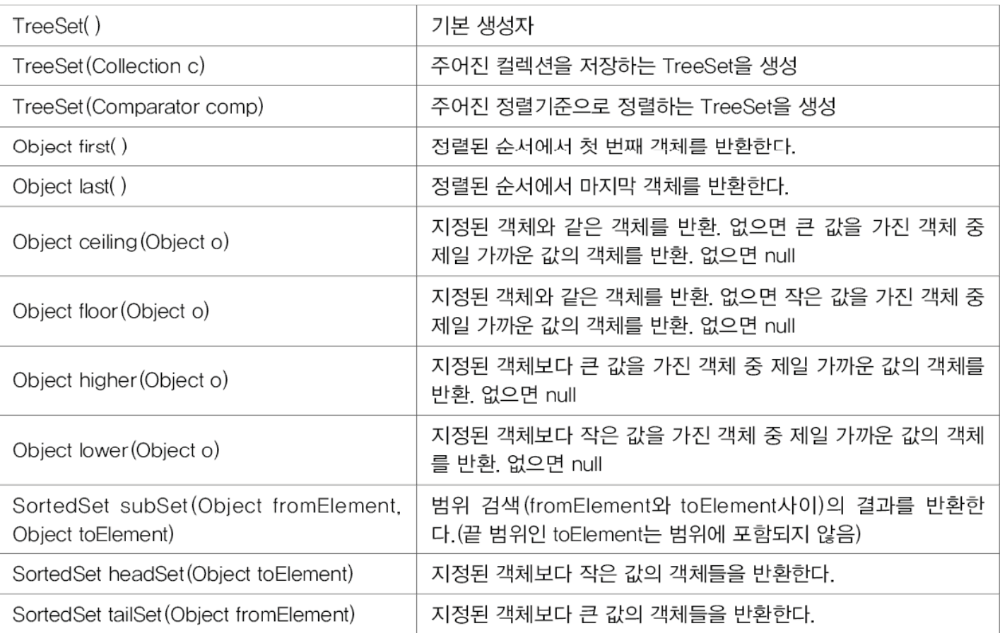
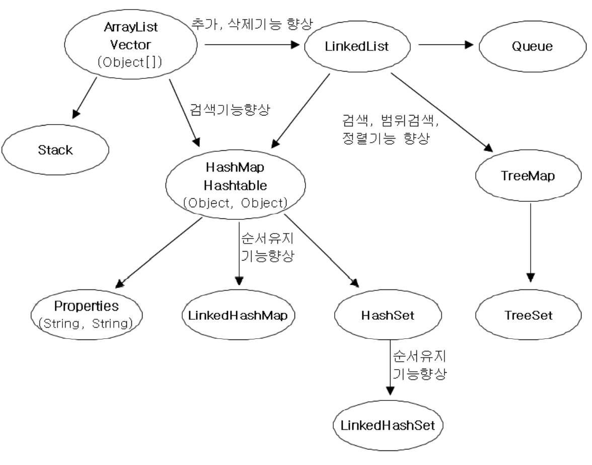

# 총정리


## 변수


-   특수문자는 '_', '$'만 허용


​	변수(variable) - 하나의 값을 저장하기 위한 공간

​	리터럴(literal) - 그 자체로 값을 의미하는 것	

``` java
int score = 100; // 100이 리터럴임
```


-   변수의 기본값

    


-   문자열에 + 하면 문자열이 됨 Object.toString() 때문인듯


### 오버플로우

ex) 

```java
byte b = 127;
b++; // b = -128
```

byte형의 최댓값에서 +를 하니 exception을 띄우지 않고 최소값으로 돌아감


### printf()


## 연산자

-   연산자 우선순위


괄호 > 산술 > 비교 > 논리 > 대입

단항 > 이항 > 삼항

and > or


-   비트연산자 <<, >>, >>>, &, |, ^

    x << n = x*2^n과 같음. 비트상에서 << 방향으로 n만큼 이동 빈 곳은 0으로 채움

    x >> n = x/2^n과 같음. 비트상에서 >>방향으로n만큼 이동, 빈 곳은 MSB(Most Significant Bit)로 채움

    (MSB <=> LSB)

    ^ = XOR


## 반복문

### 반복문 loof

-   반복문 앞에 이름을 붙이고, 그 이름을 사용해서 break, continue 사용 가능

    ``` java
    Loop1:
            for (int i = 1; i < 10; i++) {
                Loop2:
                for (int j = 1; j < 10; j++) {
                    if (j == 5) {
                        break Loop1;
                    }
                    System.out.println(String.format("%d*%d=%d",i,j,i*j));
                }
            }
    ```


## 배열

-   배열의 각 요소는 서로 연속적이다. (메모리상 연속적임 그래서 검색이 매우 빠르다)

-   System.arrayCopy()

    ``` java
    System.arraycopy(arr1, 0, arr2, 0, arr1.length);
    // arr1[0]에서 arr2[0]으로 arr1.length개의 데이터를 복사
    ```

    


## 객체지향

### 	특징

		1. 기존의 프로그래밍언어와 크게 다르지 않다.
		2. 코드의 재사용성이 높다
		3. 코드의 관리가 쉬워졌다
		4. 신뢰성이 높은 프로그램의 개발을 가능하게 한다.


### 클래스 -> 인스턴스화 -> 인스턴스(객체)


### 명시적 초기화 -> 클래스 초기화블럭(처음 한번만) -> 인스턴스 초기화 블럭 -> 생성자 


### 상속

	- 자손은 조상의 생성자와 초기화블럭을 제외한 모든 멤버를 상속받음
	- 공통부분은 조상에서 관리하고 개별부분은 자손에서 관리
	- 조상의 변경은 자손에 영향을 미치지만, 자손의 변경은 조상에 영향을 미치지 않는다.


### 하이딩

-   static 메소드를 오버라이딩 할 때 발생
-   하이딩 된 메소드는 변수와 같은 성질을 가짐(자료형에 따른 참조)


### 인터페이스

-   모든 멤버변수는 public static final, 모든 메소드는 public abstract

-   JDK1.8부터 default메소드 사용 가능(항상 public이고 생략 가능)

    *default 메소드는 인터페이스에서 메소드를 구현할 수 있게 해준다.*

    1.  여러 인터페이스의 디폴트 메소드 간의 충돌
        -   인터페이스를 구현한 클래스에서 디폴트 메소드를 오버라이딩해야 한다.
    2.  디폴트 메소드와 조상 클래스의 메소드 간의 충돌
        -   조상 클래스의 메소드가 상속되고, 디폴드 메소드는 무시된다.

-   인터페이스는 Object와 같은 최고 조상이 없다

-   인터페이스의 장점
    1.  개발시간을 단축시킬 수 있다.
    2.  표준화가 가능하다
    3.  서로 관계없는 클래스들에게 관계를 맺어 줄 수 있다.
    4.  독립적인 프로그래밍이 가능하다


### 내부클래스

-   지역클래스에서 외부 클래스의 지역변수는 상수만 접근 가능


## 예외처리

### 프로그램 오류

1.  컴파일 에러 
2.  런타임 에러
3.  논리적 에러 - 의도와 다르게 동작


### 예외처리의 정의와 목적

-   에러는 어쩔 수 없지만, 예외는 처리해야함
    -   에러 - 프로그램 코드에 의해서 수습될 수 없는 심각한 오류 (memory부족)
    -   예외 - 프로그램 코드에 의해 수습될 수 있는 다소 미약한 오류
-   예외처리의 정의와 목적
    -   정의 - 프로그램 실행 시 발생할 수 있는 예외의 발생에 대비한 코드를 작성하는 것
    -   목적 - 프로그램의 비정상 종료를 막고, 정상적인 실행상태를 유지하는 것


### RuntimeException을 상속하는 예외들은 처리하지 않아도 컴파일이 잘 됨


## 형식화

### DecimalFormat - 숫자의 형식화

### SimpleDateFormat - 날짜의 형식화

### MesssageFormat - 텍스트의 형식화


## 컬렉션 프레임웍

-   Collection, Set 인터페이스의 메소드


-   List인터페이스의 메소드

    


-   Map인터페이스의 메소드

    


-   ListIterator - List 컬렉션들의 iterator (Iterator의 접근성을 향상시킴. 단방향 -> 양방향)

    


### Arrays

-   deepEquals(), deepToString() : **다차원 배열의 비교와 출력**

-   cofyOf(), copyOfRange() : **배열의 복사**

    -   int[] arr = Arrays.copyOf(new int[]{0,1,2,3,4},7); // [0,1,2,3,4,0,0]
-   copyOfRange(source, from, to)
    
-   fill(), setAll() : **배열 채우기**

    -   Arrays.fill(source, value);
    -   Arrays.setAll(T[] source, IntFunction<? extends T> generator)

-   asList(Object... a) - **배열을 List로 변환**

    ``` java
    List list = Arrays.asList(new Integer[]{1,2,3,4,5});
    list.add(6); // Error, list의 크기를 변경할 수 없음.
    List list = new ArrayList(Arrays.asList(1,2,3,4,5)); // 변경 가능
    ```

-   sort(), binarySearch() - **배열의 정렬과 검색**


### Comparator 와 Comparable

-   Comparable : 기본 정렬기준을 구현하는데 사용. // compareTo
-   Comparator : 기본 정렬기준 외에 다른 기준으로 정렬하고자할 때 사용. // compare
-   


### TreeSet의 메소드




### HashMap의 메소드


### Collections

**컬렉션을 위한 메소드 제공**

1.  컬렉션 채우기, 복사, 정렬, 검색 - fill(), copy(), sort(), binarySearch() 등
2.  컬렉션의 동기화 - synchronizedXXX()
3.  변경불가 컬렉션 - unmodifiableXXX()
4.  싱글톤 컬렉션 - singletonXXX()
5.  이외에 다양한 메소드 많음(shuffle도 있음)





## 제네릭스

-   **컴파일시 타입을 체크해 주는 기능 - JDK1.5**
-   **객체의 타입 안정성을 높이고 형변환의 번거로움을 줄여줌**


### 제약사항

-   static멤버에는 타입 변수 T를 사용할 수 없음 (당연한듯)

    ``` java
    class Box<T> {
        static T item; // 에러
        static int compare(T t1, T t2) {...} // 에러
    }
    ```

-   제네릭 타입의 배열 T[]를 생성하는 것은 허용되지 않음

    ``` java
    class Box<T> {
        T[] itemArr; // OK. T타입의 배열을 위한 참조변수
        
        T[] toArray() {
            T[] temArr = new T[itemArr.length]; // 에러. 제네릭 배열 생성불가
        }
    }
    ```

    이유는 new 연산자 때문인데, new는 컴파일 시점에서 타입 T가 정확히 무엇인지 알기를 원하기 때문이다.

    굳이 꼭 만들어야 겠다면 Class 객체의 newInstance()를 사용하거나 Object 배열을 생성하여 복사한 다음 T로 형변환 해주면 된다.


### 규칙

```java
class MyClass<T extends MyParents> { // MyParent의 자손들만 타입으로 지정 가능
    ArrayList<T> list = new ArrayList<>(); // 당연히 T만 들어감 <> -> 다이아몬드 연산자
    void add(T item) { // 여기도 매개변수로 T만 들어감
        list.add(item);
    }
}

class MyClass<T extends Mother & Father> {...} // 인터페이스의 경우에도 extends 사용
```

-   와일드 카드

    ``` java
    static void method(MyClass<? extends MyParents> myClass) {
        // method의 매개변수인 myClass의 타입은 MyParent를 상속하면 가능
    }
    
    method(new MyClass<MyParents>); // 당연히 가능
    method(new MyClass<MyChild>); // 이거도 가능
    
    MyClass<MyParents> parents = new MyClass<MyChild>(); // 이거도 가능
    ```


-   제네릭 메소드

    ``` java
    static <T> void sort(List<T> list, COmparator<? super T> c); // 반환타입 앞에 제네릭 타입이 선언된 메소드
    
    // 클래스의 타입 매개변수<T>와 메소드의 타입 매개변수 <T>는 별개이다.
    
    class Box<T> {
        static <A> void sort(List<A> list, T t) {
            // 저렇게 파라미터 안에도 제네릭 <> 요런게 달려있는거로 구별하자
        }
    }
    ```

    


-   원시 타입간의 형변환은 불가능

    ``` java
    Box box = null;
    Box<Object> objBox = null;
    
    box = (Box)objBox; // OK. 제네릭 -> 원시타입. 경고 발생
    objBox = (Box<Object>)box; // OK. 원시타입 -> 제네릭타입. 경고 발생
    ```

    


## 열거형


-   관련된 상수들을 같이 묶어 놓은 것.  Java는 타입에 안전한 열거형을 제공한다.

    ``` java
    class Card {
        static final int CLOVER = 0;
        static final int HEART = 1;
        static final int DIAMOND = 2;
        static final int SPADE = 3;
    
        static final int TWO = 0;
        static final int THREE = 1;
        static final int FOUR = 2;
        
        final int KIND;
        final int NUM;
    }
    ```
    
    ``` java
    class Card {
        enum Kind { CLOVER, HEART, DIAMOND, SPADE} // 열거형 Kind를 정의
        enum Value { TWO, THREE, FOUR} // 열거형 Value를 정의
        
        final Kind kind;
        final Value value;
    }
    ```


### 열거형 사용법

``` java
enum MyEnum { A, B, C, D}

class MyClass {
    MyEnum EEE; // 열거형 변수 선언
    void method() {
        EEE = MyEnum.A; // 이렇게 사용함
    }
    
    void test() {
        if (EEE == myEnum.B) {
            // 이렇게 할 수도 있음
        } else if (EEE > MyEnum.B) {
            // 당연히 안됨. 열거형 역시 객체
        } else if (EEE.compareTo(MyEnum.B) > 0) {
            // 이건 가능
        }
    }
}
```


### 열거형의 메소드

-   모든 열거형은 java.lang.Enum의 자손

    

-   컴파일러가 자동적으로 추가해 주는 메소드도 있음.

    ``` java
    static E valuse(); // 배열로 리턴
    static E valueOf(String name); // name에 맞는 이름을 가진친구 반환
    ```

    

### 열거형의 이해

``` java
enum MyEnum {
    AAA(1,"a"), BBB(2), CCC;
    // ~~~
}
// 두개가 같음
class MyEnum {
    static final MyEnum AAA = new MyEnum("AAA");
    static final MyEnum BBB = new MyEnum("BBB");
        //~~~
}
```


## 쓰레드


 ### 프로그램(실행) -> 프로세스(자원, 쓰레드로 구성) -> 쓰레드(진짜 일하는 친구들)


-   싱글 쓰레드 : 자원 + 쓰레드

-   멀티 쓰레드 : 자원 + 쓰레드가 n개 (n > 1)

    

 #### start() 하면 새로운 호출스택에 run() 메소드가 담긴다


### 쓰레드의 우선순위 (어차피 OS스케쥴러가 관리해서 생각보다 효과가 크지 않을 수 있음)

-   void setPriorty(int newPriority) - 쓰레드의 우선순위를 변경

-   int getPriority() - 쓰레드의 우선순위 반환

    

### 쓰레드 그룹

-   서로 관련된 쓰레드를 그룹으로 묶어서 다루기 위함 (보안상의 이유)

-   모든 쓰레드는 반드시 하나의 쓰레드 그룹에 포함되어 있어야 함.

-   쓰레드 그룹을 지정하지 않고 생성한 쓰레드는 main쓰레드 그룹에 속함

-   자신을 생성한 쓰레드(부모 쓰레드)의 그룹과 우선순위를 상속받음.

    


### 쓰레드의 실행제어

-   메소드들

    

    resume, stop, suspend는 쓰레드를 교착상태로 만들기 쉽기 때문에 deprecated됐다. 쓰면안됨 그래서 오버라이드 해서 씀


### 쓰레드의 상태


### volatile, Lock & Condition, join & fork 공부 필요


## Lambda & Stream

### Lambda

-   함수(메소드)를 간단한 식으로 표현하는 것
-   단 하나뿐인 문장이 return문이면 괄호 생략 불가
-   함수형 인터페이스 타입의 참조변수로 람다식 참조 가능


### 자주 사용되는 함수형 인터페이스 java.util.function

-   java.lang.Runnable : void run() == **매개변수 x, 반환값 x**
-   Supplier<T> :  T get() == **매개변수 x, 반환값 o**
-   Consumer<T> : void accept(T t) == **매개변수 o, 반환값 x**
-   Function<T,R> : R apply(T t) == **매개변수 o, 반환값 o**
-   Predicate<T> : boolean test(T t) == **매개변수 o, 반환값 boolean**
-   UnaryOperator<T> : T apply(T t) == **매개변수 T, 반환값 T (타입 일치)**
-   BinaryOperator<T> : T apply(T t1, T t2) == **매개변수 t1, t2, 반환값 T (타입 일치)**


#### 함수형 인터페이스를 사용하는 컬렉션 프레임웍의 메소드


#### 기본형을 사용하는 함수형 인터페이스

​	파라미터To입력Function<없을경우 얘로채움>

-   AToBFunction -> B apply(A a)

    ex) IntToDoubleFunction -> double apply(int i)

-   ToBFunction<T> -> B applyAsInt(T t)

-   AFunction<T> -> T apply(A t)

-   ObjACunsumer<T> -> void accept(T t, int i)


#### Function의 합성

f.andThen(g) -> g(f(x)) = f 후 g

f.compose(g) -> f(g(x)) = g 후 f


#### Predicate 결합

-   and(), or(), negate() = !
-   등가비교는 isEqual()


## Stream

-   **얜 Iterator같이 원본 소스를 변경할 수 없음. 오직 참조만 함**

-   **Iterator처럼 1회용이다**

-   **최종 연산 전까지 중간연산이 수행되지 않는다.**

    -   Lazy Evalution(지연 연산)

        불필요한 연산을 피하기 위해 연산을 지연하는걸 말함

        ``` java
        final List<Integer> list = Arrays.asList(1, 2, 3, 4, 5, 6, 7, 8, 9, 10);
         
        System.out.println(
            list.stream()
                .filter(i -> i<6)
                .filter(i -> i%2==0)
                .map(i -> i*10)
                .findFirst()
                .get()
        );
        ```

        여기서 모든 요소에 대한 첫번째 필터 -> 모든 요소에 대한 두번째 필터 -> 모든 요소에 대한 맵 -> findFirst 이럴것 같지만 이건 Eager Evalution이다.

        Lazy는 최종 연산을 보고 효율적인 중간연산을 수행한다.

        저건 

        1.  i < 6
        2.  i%2 == 0
        3.  i < 6
        4.  i % 2 == 0
        5.  i *= 10
        6.  findFirst()

        이런식이다


### 스트림 생성

-   컬렉션으로부터 생성

    ``` java
    (컬렉션 인스턴스).stream()
    ```

-   배열로부터 생성

    ``` java
    Stream.of("a","b","c"); // 가변인자
    Stream.of(new String[]{~~~});
    Arrays.stream(new String[]{~~~});
    Arrays.stream(new String[]{~~~}, 0, 3);
    ```

-   특정 범위의 정수를 요소로 갖는 스트림

    ``` java
    IntStream.range(1,5); // rangeClosed도 있음
    ```

-   난수를 요소로 갖는 스트림

    ``` java
    new Random().ints();
    ```

-   람다식을 소스로 하는 스트림

    ``` java
    static <T> Stream<T> Stream.iterate(T seed, UnaryOperator<T> f); // 이전 요소에 종속적
    static <T> Stream<T> Stream.generate(Supplier<T> s); // 이전 요소에 독립적
    ```

-   파일을 소스로 하는 스트림

    ``` java
    Stream<Path> Files.list(Path dir);
    ```


### 중간연산 메소드


### Optional<T>

-   객체의 값 가져오기 -get, orElseGet, orElseThrow

    ``` java
    Optional<String> optVal = Optional.of("abc");
    String str1 = optVal.get(); // null이면 예외
    String str2 = optVal.orElse("A"); // null이면 "A"반환
    String str3 = optVal.orElseGet(String::new); // 람다 사용가능
    String str4 = optVal.orElseThrow(Exception::new); // null이면 예외 던짐
    optVal.isPresent(); // null이면 false 반환
    optVal.ifPresent(Consumer); // null이 아니면 작업 수행, null이면 안함
        
    ```

    